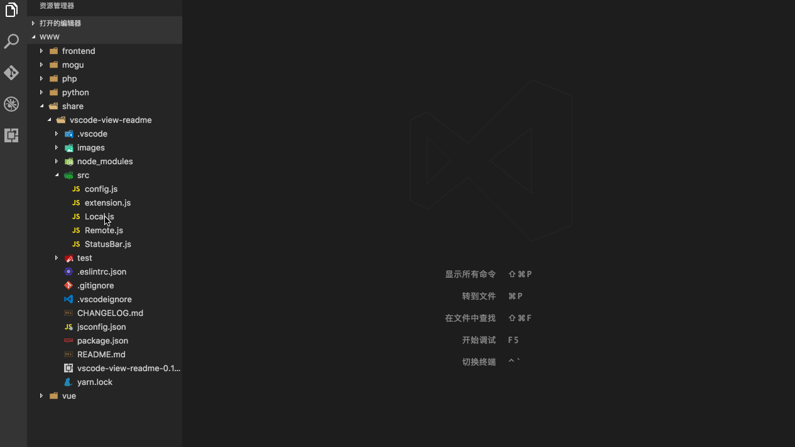

# view-readme

Open readme.md at nearly path of node_modules quickly. 

### Commands

* Readme: Open markdown file

### KeyBindings

* Mac: cmd+shift+l (Readme: Open markdown file)
* Win: ctrl+shift+l (Readme: Open markdown file)
