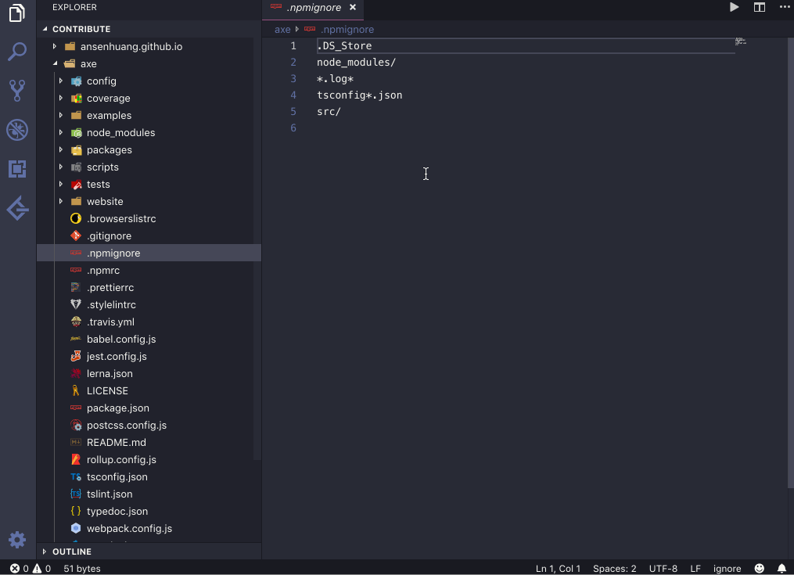

# vscode-view-readme

Open docs or files in node_modules quickly.

## Commands

* viewReadme: Open docs in markdown from closest node_modules
* viewReadme: Open files from closest node_modules

### KeyBindings

* Mac
  - cmd+shift+l (open docs in markdown)
  - cmd+shift+j (open files from node_modules)
* Win
  - ctrl+shift+l (open docs in markdown)
  - ctrl+shift+j (open files from node_modules)

**Enjoy!**
